## Test cases

### Test case for add function (failed)

## Test case for add function (pass)

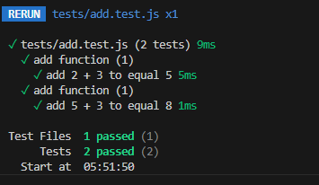

## Test case for subtract function (pass)

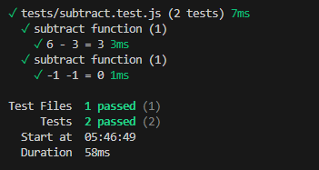

## Test case for subtract function (failed)

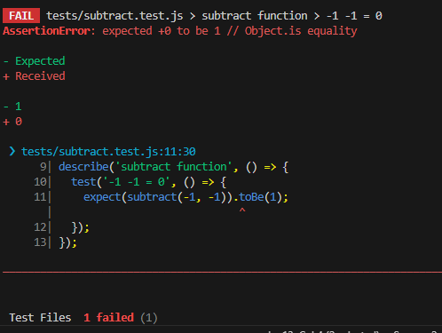

## Test case for multiply function (pass)

## Test case for multiply function (failed)

## Test case for divide function (pass)

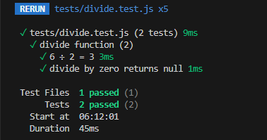

## Test case for divide function (failed)

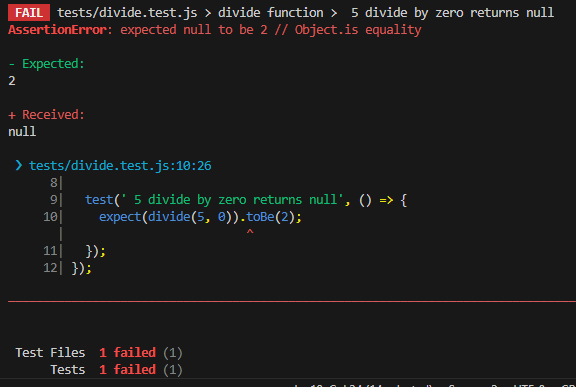

## Test case for reverseString function (pass)

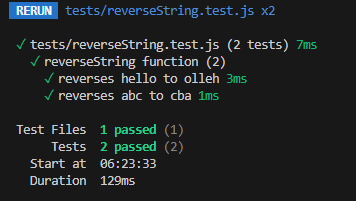

## Test case for reverseString function (failed)

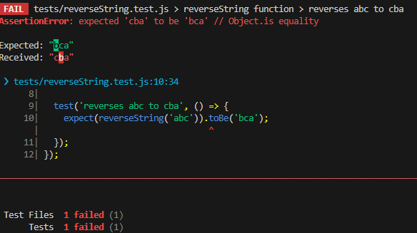

## Test case for isPalindrome function (pass)

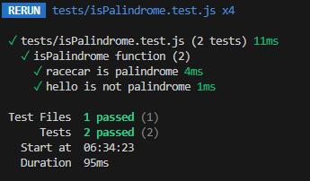

## Test case for isPalindrome function (failed)

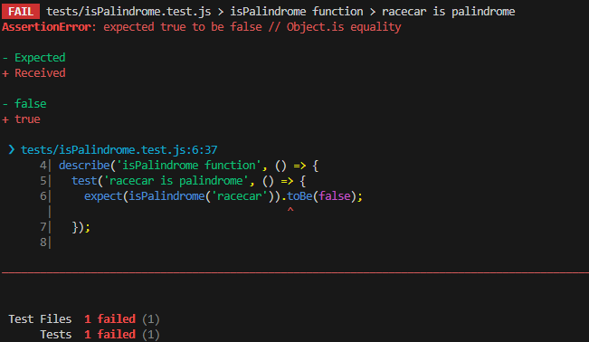

## Test case for findMax function (pass)

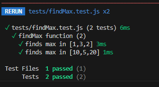

## Test case for findMax function (failed)

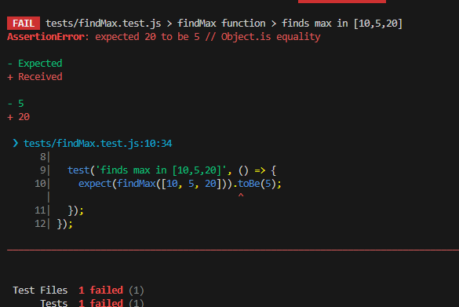
